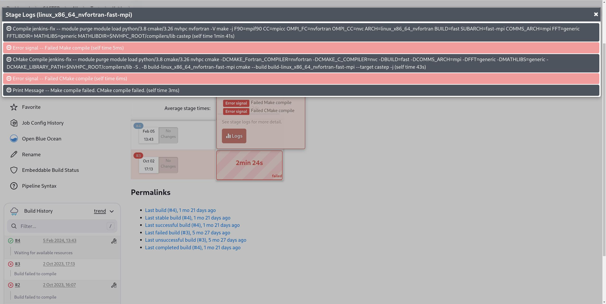

# CI Testing System

## Overview

!!! warning "Notice"

    The following document assumes you have access to both the CASTEP source and the
    ANVIL CI system.

The CASTEP CI system is divided into 3 phases:

[Rapid Response (BitBucket)](#bitbucket-pipelines)
: A short set of tests run whenever a PR is created or pushed to.

[CASTEP PR Tests (Jenkins)](#jenkins-pipelines)
: A more substantial set of tests run whenever a PR is created or pushed to.

[CASTEP Default Tests (Jenkins)](#default-builds)
: A set of tests run whenever default or a release branch is merged to.

The main CASTEP continuous integration (CI) system is a
[Jenkins](https://www.jenkins.io/) instance run on the
[ANVIL](https://anvil.softeng-support.ac.uk/) service.

The main CASTEP Jenkins instance is available at:

https://anvil.softeng-support.ac.uk/jenkins/job/CASTEP/view/all/

Going through the Jenkins Dashboard will take you to the [waterfall
diagram](#waterfall-diagram) landing page.

<!-- In order to request access to the ANVIL service to check the status of
testing please [contact here]() -->

!!!note

    The ANVIL service is an STFC-cloud managed system and requests to register will
    be considered by them on a case-by-case basis and are out of control of the
    CASTEP team.

### Personal Pipeline

For the purposes of development testing you can request a personal pipeline in
order to be able to rapidly test in the variety of environments under which the
main CASTEP testing is performed.

This is required for e.g. [modifying the `Jenkinsfile`](#contributing-to-the-jenkinsfile)

Access to this pipeline will require an ANVIL account and a reasonable cause for
the request.

## Navigating Jenkins

### Waterfall diagram

The landing page from the Jenkins dashboard is the Waterfall diagram which shows
a quick display of the most recent results for the `default`, `Release` and
`PR_builds` pipelines.

!!! tip

    To enable accessibility options including text-scale and colourblind mode,
    select the gear in the top-right.


The colours represent the status of the pipeline:

| Colour | Colourblind     | Meaning                                                          |
|:------:|:---------------:|:----------------------------------------------------------------:|
| Green  | Plain           | Previous run succeeded.                                          |
| Orange | Diamonds        | Previous run failed tests, but built successfully.               |
| Red    | Diagonal stripe | Previous run failed to build one or more pipelines successfully. |

!!! note

    The text below the pipeline describes how long the pipeline has been failing as
    well as the extent of the failure.

Clicking on any of the pipeline names will take you to the pipeline menu for
that pipeline.

### Pipeline Menu

The pipeline menu is the display of the status for any single pipeline. It has a
number of important displays and buttons.

The figure below highlights these.


!!! note

    The side-bar is dynamic and the options available to you may not match those in
    the figure above for any particular pipeline. For example, this pipeline has not
    generated a coverage report.

#### Navigation Bar

The navigation bar allows you to look at other pipelines, each name is a link to
that section/level of the Jenkins.

!!! warning

    The "CASTEP" level button will take you to the Waterfall landing page. In order
    to get to the top-level CASTEP dashboard, select "All" instead.

When viewing [linter and warning reports](#linting-and-compiler-warnings) the
navigation bar will also display the currently applied filters in the order they
were applied and serves as the way to remove those filters.

#### Pipeline Status

The pipeline status shows the previous run statuses. It is possible to click on any stage, and then logs to get a step-by-step breakdown of the issue. Any step that failed will be coloured pink rather than the usual grey.



It is then possible to click on the tab to expand the console output for that particular step. Generally in the case of:

- builds
: this will be the `Compile` step **above** the failure.

- tests
: this will be the `Diff` step **below** the failure.


!!! note

    Clicking the step name will take you to a different page with a full-page
    display of the output of that step.

!!! tip

    Tabs collapse when another is selected.

#### Reports

During a Jenkins run, several "reports" may be created and made available in the
side-bar of a pipeline that generates them.

##### Linting and Compiler Warnings

Following a build, Jenkins will collect the compiler warnings issued during a
build along with, if a linting phase is run, the resulting linter issues into a
report accessible through the side-bar.

!!! warning

    The warning collection will take the set of warnings from the first build using
    any of the following compilers:

    - gfortran
    - ifort
    - nag

    This means that if the first item for each compiler in `builds_to_run` (see
    [manual parametrised runs](#manual-parametrised-runs)) is not an `opt=debug`
    build, you may miss most warnings.


The reports allow the types of issues to be selected and filtered:

- They can be grouped and sorted by clicking the appropriate buttons above the
  main table and table entries.

- The doughnut of severity is actually a clickable filter to filter to
  warnings of that level!

- The `+` icon to the left of the issue in "Issues" "group by" mode allows you to expand the
  issue to get more detail.

- Selecting the file from the "File" column displays annotated source, however,
  see the issue below.

!!! failure "Known issue"

    Due to the relatively large sizes of CASTEP source files, while selecting the
    `file:line` link will take you to an annotated copy of the source at the point
    of the issue in question, the rendering engine tends to bog down machines
    causing browsers to struggle or fail to load the annotated file.

##### Test Coverage Report

Whenever a `coverage` build is run (i.e. with either the `ifort` or `gfortran`
compiler and `opt=coverage`), Jenkins will accumulate the coverage reports and
make them accessible in the side-bar.


!!! failure "Known issue"

    Due to current security settings on ANVIL the `ifort` reports are not
    viewable through this view and must be downloaded to be viewed.

##### FORD API Documentation

As part of the full build of the `default` branch following a merge, Jenkins
will trigger a [FORD](https://forddocs.readthedocs.io/en/latest/) API
documentation build.

The results of this build are accessible from the side-bar of the
`CASTEP > All > Default_branch > docs-trigger` pipeline.

#### Build Artefacts

During a Jenkins run, various files will be preserved, making them available to
download.

Currently the artefacts that are preserved are:

- Linting reports
- Failed test data
- Coverage reports
- FORD Documentation

Some artefacts are available for download at the top of the pipeline menu above
the previous runs.

For interactive reports (coverage and FORD), when opened the download button is
available in the top-right.

## Jenkins Pipelines

The tests run in the course of CI are controlled through the `Jenkinsfile` in
the root CASTEP folder.

### Default builds run

In general, the default set of configurations are run on `rocky8` using:

- Intel 23
- Ifx 24
- GCC 13
- GCC 9
- NAG 7.1
- NVFortran 23.7

with different combinations of `arch`, `comms` and external libraries attempting
to cover a broad scope of possible use-cases.

!!! note

    All `default` or manual builds will also run a test of the correctness and
    completeness of the source distribution GNU make and CMake `dist` targets.

??? note "Default build keys"

    At time of writing, the default [build keys](#build-keys) are:

    ```
    rocky8;linux_x86_64_ifort;debug;mpi#intel23
    rocky8;linux_x86_64_gfortran;debug;mpi#gcc9
    rocky8;linux_x86_64_nag;debug;serial
    rocky8;linux_x86_64_gfortran10;coverage;mpi#gcc13-libxc
    rocky8;linux_x86_64_ifort;coverage;serial#intel23-nocmake
    rocky8;linux_x86_64_ifort;fast;serial#intel23-nocmake
    rocky8;linux_x86_64_gfortran;fast;mpi#gcc9-nocmake
    rocky8;linux_x86_64_gfortran10;fast;mpi#gcc13-nocmake
    rocky8;linux_x86_64_gfortran10;fast;serial#gcc13-nocmake
    rocky8;linux_x86_64_nvfortran;fast;mpi#nogrimmed4
    rocky8;linux_x86_64_ifx;fast;mpi#ifx24-nocmake
    ```
    However, these are subject to change.

### PR Builds run

When a PR is opened, BitBucket triggers a small subset of the Jenkins
tests.

These builds only run the `quick` subset of the tests.

!!! note

    If a PR only affects parts of CASTEP which are not tested, such as documentation
    or separate tools, it should have `[skiptest]` or `[skipanvil]` in the PR title.

    If a PR is not yet ready for testing, it should have `[wip]` or `[draft]` in the PR title.

    These will prevent the PR from triggering the Jenkins build saving resources.


??? note "Default PR builds"

    These builds are (at the time of writing):

    ```
    rocky8;linux_x86_64_nag;intermediate;serial#nocmake
    rocky8;linux_x86_64_gfortran10;fast;mpi#gcc13-fftw-nocmake
    rocky8;linux_x86_64_ifort;intermediate;serial#intel23-nocmake
    rocky8;linux_x86_64_nvfortran;fast;serial#nogrimmed4-nognumake
    ```

    However, these are subject to change.

### Manual Parametrised Runs

If you wish to start a run with a particular subset of configurations or tests,
it is possible to start a parametrised run manually.

From the Jenkins interface select the pipeline to run the build on (see
[Personal Pipelines](#personal-pipeline)) and select `Build with
Parameters`. This allows one to manually specify the components to use.

??? note "Parameters"

    The parameters are as follows:

    | Parameter                         | Meaning                                                                             | Default                                                  |
    |:---------------------------------:|:-----------------------------------------------------------------------------------:|:--------------------------------------------------------:|
    | `repo_method`                     | Define method to retrieve repo. <br>**Should not need to be changed.**              | `https`                                                  |
    | `repo_host`                       | URL to repository if externally hosted. <br>**Should not need to be changed.**      | `bitbucket.org`                                          |
    | `repo_path`                       | URL Path to workspace and repository. [^1^](#urlnote)                               | `castep/castep`                                          |
    | `branch`                          | Branch to build and test. [^2^](#branchnote)                                        | `default`                                                |
    | `builds_to_run`&nbsp;&nbsp;&nbsp; | Builds to run as list of [build keys](#build-keys).                                 | see: [Default builds list](#default-builds-run)          |
    | `tests_to_run`                    | List of tests to run.                                                               | all except `quick`                                       |
    | `baseURL`                         | Slack URL to post mesasge to. <br>**N.B.** Set to empty string to not send message. | `https://corecastepdevelopers.slack.com/services/hooks/` |
    | `lint`                            | Run or skip linting stage.                                                          | `true`                                                   |

    <!-- Could make these notes, sidenotes, full footnotes or fake footnotes like this -->

    ^1^<a name="urlnote"></a>
    The command run as part of the checkout will be roughly equivalent to:

    ```sh
    git clone ${repo_method}://${repo_host}/${repo_path} --single-branch --branch ${branch}
    ```

    ^2^ <a name="branchnote"></a>Jenkins will automatically push the run's status to the `HEAD` commit of the
    branch being tested at the time of the run.

!!! warning

    Pushes to the branch while a test is running may result in Jenkins picking up
    the latest changes and running partial tests on the new `HEAD`

#### Build keys

The Jenkins tests are able to be run on a variety of different system
configurations. In order to select a particular configuration, it is necessary
to specify the key which identifies the configuration.

The format of these keys is:

```
agent;arch;opt;comms#comment
```

Where `agent` is one of:

- `rocky8` -- Rocky Linux 8
- `rocky8-gpu` -- Rocky Linux 8 with GPU support
- `rocky9` -- Rocky Linux 9
- `icdpacewin` -- Windows

and `arch`, `opt` and `comms` correspond to the CASTEP build system variables
`ARCH`, `OPT` and `COMMS`. `comment` is used to distinguish otherwise similar
variants and uniquely identify a particular configuration as well as apply
modifications to the build (see [comment tags](#comment-tags)).

It should be noted, however, that only certain combinations of variables are
available on certain agents. For a full set of available combinations it is
necessary to look into the `Jenkinsfile` itself as this list is frequently
updated and changed.

#### Comment Tags

The comment section of the build key allows changes to the configuration outside
of the usual build flags.

These are added in the following way (adding `nocmake`):

If the base build does not have a comment
: `rocky8;linux_x86_64_nag;debug;serial#nocmake`


If it does
: `rocky8;linux_x86_64_ifort;debug;mpi#intel23-nocmake`

Multiple comment tags are joined with `-`
: `rocky8;linux_x86_64_ifort;debug;mpi#intel23-nocmake-nognumake`

??? note "Comment tags"

    Currently the available tags are:

    <!-- Weird nbsp is to force Tag to not line-wrap-->

    | Tag                          | Effect                                                                                               |
    |:----------------------------:|:----------------------------------------------------------------------------------------------------:|
    | `targetHost`                 | Compiles optimised CASTEP targetting the VM architecture                                             |
    | `targetPortable`&nbsp;&nbsp; | Compiles portable CASTEP                                                                             |
    | `libxc`                      | Links CASTEP against LibXC                                                                           |
    | `nogrimmed3`                 | Does not compile (or test) D3 SEDC                                                                   |
    | `nogrimmed4`                 | Does not compile (or test) D4 SEDC                                                                   |
    | `nodlmg`                     | Does not compile (or test) DLMG libraries                                                            |
    | `debug`                      | Enable verbose build stages                                                                          |
    | `nocmake`                    | Disable the CMake build phase and test                                                               |
    | `nognumake`                  | Disable the GNU Make build phase and test, run specified test suite on CMake build (if not disabled) |

    <!-- | Make added           | Cmake added                    -->
    <!-- |:--------------------:|:-----------------------------: -->
    <!-- | `TARGETCPU=host`     | `-DPORTABLE=OFF`               -->
    <!-- | `TARGETCPU=portable` | `-DPORTABLE=ON`                -->
    <!-- | `LIBXC=compile`      | `-DWITH_LIBXC=ON`              -->
    <!-- | `GRIMMED3=none`      | `-DWITH_GRIMMED3=OFF`          -->
    <!-- | `GRIMMED4=none`      | `-DWITH_GRIMMED4=OFF`          -->
    <!-- | `DL_MG=none`         | `-DWITH_DLMG=OFF`              -->
    <!-- | `VERBOSE=1`          | `-DCMAKE_VERBOSE_MAKEFILE=ON`  -->
    <!-- | -                    | `NO_CMAKE`                     -->
    <!-- | `NO_GNUMAKE`         | -                              -->

## BitBucket pipelines

In addition to the main Jenkins tests, there is also a subset of short, fast
tests which are run on BitBucket every commit to ascertain functionality
quickly.

The BitBucket pipelines are managed through the `bitbucket-pipelines.yml` in the
root CASTEP folder.

They currently run:

- `lint` -- Run the [castep-linter](https://pypi.org/project/castep-linter/) on
  the source.
- `build-castep` -- A `debug` build of CASTEP with included LibXC
- `build-castep-python` -- `debug` build of CASTEP's Python bindings
- `test-castep` -- Run of CASTEP's `quick` test suite.
- `test-python` -- Run of CASTEP's `python` test suite.

All of these are performed on a single image of a Linux system compiled with
`gfortran` and static `LAPACK` and `BLAS` libraries. They are not to be
considered comprehensive.

## Modifying the Jenkinsfile

### Adding new configurations

To add a new combination
(c.f. [Modifications](#modifications-to-the-jenkinsfile)), it is necessary to
define it in the `matrix` variable in the `Jenkinsfile`. This `matrix` is a
Groovy `Map` object which translates a particular configuration to a `Map` of
extra parameters needed to perform the build.

i.e.
```groovy
matrix = [
    "agent;arch#comment": ["modules": "", "fft": "", ...],
    ...
]
```

!!!note

    All parameters are optional. To specify an empty `Map` (no parameters) use:
    ```groovy
    [:]
    ```

The list build parameters is outlined in the `get_buildconfig_from_map` function.

??? note "Build Parameters"

    Currently the build parameters are:

    | Parameter                            | Description                                                                 | Default     |
    |:------------------------------------:|:---------------------------------------------------------------------------:|:-----------:|
    | `modules`                            | Modules to load on Linux agents[^1^](#modulenote)                           | `""`        |
    | `fft`                                | Passed as the CASTEP build system variable `FFT`                            | `"generic"` |
    | `math_libs`                          | Passed as the CASTEP build system variable `MATHLIBS`                       | `"generic"` |
    | `fft_lib_dir`                        | Passed as the CASTEP build system variable `FFTLIBDIR`                      | `""`        |
    | `math_lib_dir`                       | Passed as the CASTEP build system variable `MATHLIBDIR`                     | `""`        |
    | `extra_args`                         | Extra command-line arguments passed literally to the GNU make build system. | `""`        |
    | `cmake_extra_args`&nbsp;&nbsp;&nbsp; | Extra command-line arguments passed literally to the CMake build system.    | `""`        |

    ^1^<a name="modulenote"></a>
    The list of available modules can be found on the ANVIL system under `Examples`
    -> `List of available software`.

### Adding new comment tags

Comment tags are managed in the `get_buildconfig_from_map` routine. They are
processed out of the matrix key, so they can be applied to any particular build
configuration.

A closure within the routine (`process_buildconfig_arg`) handles this process,
its signature is:

```groovy
process_buildconfig_arg(String comment_key, String make_arg, String cmake_arg)
```
Where:

`comment_key`
: Comment tag to process

`make_arg`
: Extra CLI args to pass to GNU Make build

`cmake_arg`
: Extra CLI args to pass to CMake build

This routine checks for the presence of the comment tag, removes it from the
build lookup key and adds `make_arg` and `cmake_arg` to their respective
argument lists.

!!! note

    In cases where you do not need to add or modify the compilation arguments, it is
    reasonable to put them as empty strings (`""`).  The comment tags are still
    passed through to `config[0]` which can be checked for the presence of the key.


### Submitting modifications to the Jenkinsfile

For any PR with a modification to the Jenkinsfile to be accepted it must be
provided with the following:

- Detailed description of the reasons for the change as well as the changes themselves
- A [custom pipeline](#personal-pipeline) run demonstrating the use of the
  modified pipeline with all expected use-cases, which may include:
    * Each agent in common usage (Currently `rocky8`, `icdpacewin`, `rocky8-gpu`)
    * A significant selection of the build configurations in common usage
    * Including at least one WITH a comment, and one without
    * Combinations of common tags
    * All tests (including `quick` which is not default)

!!! note

    In order to develop and test a custom `Jenkinsfile`, it is necessary to make a request to one
    of the Jenkins admins to reconfigure [your pipeline](#personal-pipeline) to point to the relevant
    repository prior to being able to run the custom `Jenkinsfile`.
