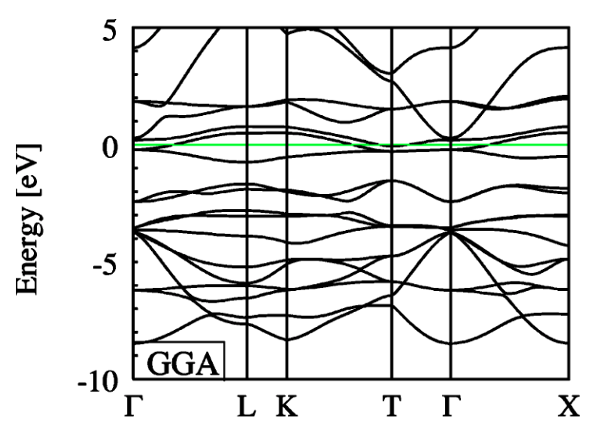
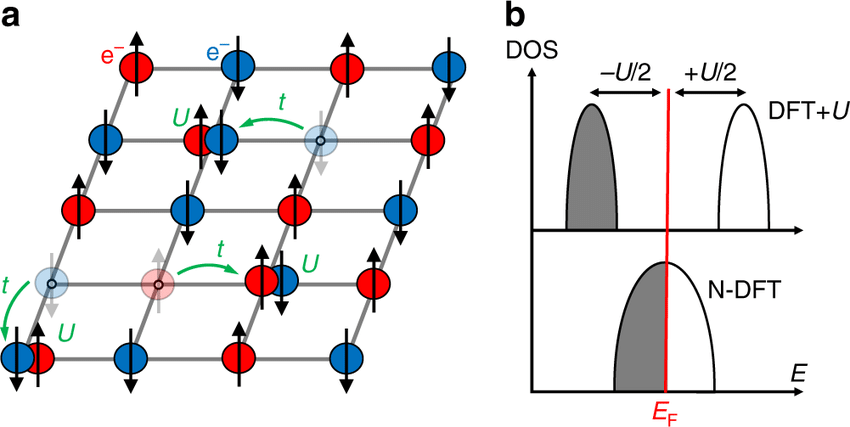
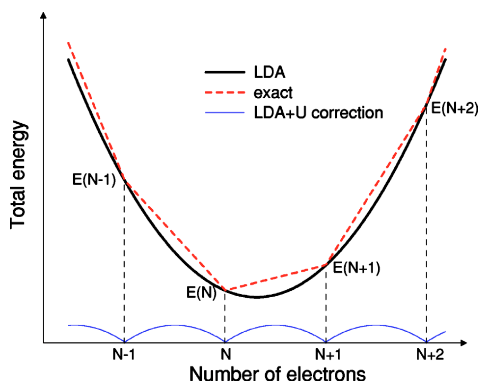
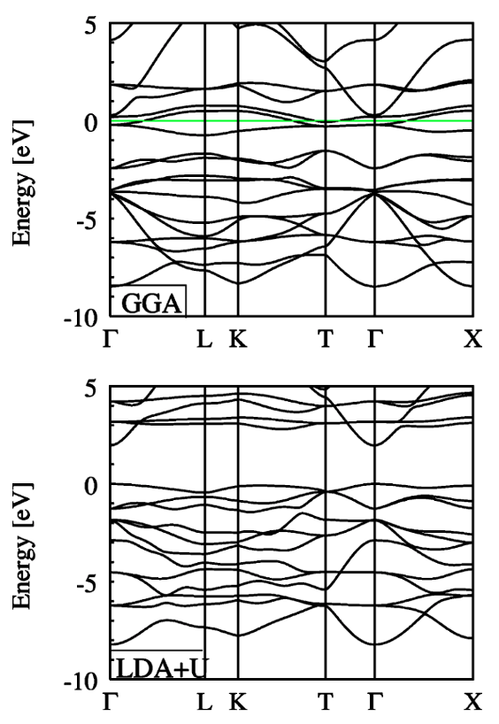

## The problem
### Electron correlation
Transition metal oxides and rare-earth metal compounds have highly localised d and/or f electrons. This leads to strong on-site electron correlation, of which, the exchange-correlation functionals of density functional theory struggle to describe. This can lead DFT to give metallic descriptions of insulating materials:

|  |
| :--: |
| DFT incorrectly describes FeO as a metal - we would expect, from experiment, insulating behaviour with a band gap of around $2.5$ eV.[^1] |

### Other functionals
Some functionals perform slightly better than others, and some even try to account for a portion of the problem. For example, due to its lower self-interaction error, (r-)SCAN can attain slightly better band gap results in some cases.

## A solution
### The Hubbard U model
The Hubbard model discusses the hopping of electrons between different sites in a lattice. The penalty for electrons to hop to another site is denoted by the parameter, $U$. See **a**. In a crystal, this repulsion term introduces a gap in the density of states proportional to $U$. See **b**.

|  |
| :--: |
| The Hubbard model that inspires the DFT+U method. |

This energetic penality for the delocalisation of electrons can be appended to the DFT potential, to give the DFT+U functional,

$$ E_{\text{DFT+U}} = E_{\text{DFT}} + \frac{U}{2}\sum_{i}q_{i}\left(1-q_{i}\right), $$

where $q_{i}$ is the occupancy of orbital $i$. This potential encourages completely empty ($q\simeq0$) or fully filled ($q\simeq1$) orbitals. This term would typically be applied to the d or f electrons of the transition metal(s) or rare-earth metal(s) in the compound of investigation.

!!! Note
    This formulation is derivable by imposing that the magnetic interactions are $0$, or alternatively that some portion of their effects are described through an effective $U_\text{eff}$ of both Coulombic and magnetic potentials. In short, the Hubbard $J$ is set to $0$ here.

### Motivation
A fractional occupancy of electrons should be described by a statistical mixture of energies,

$$ E = \left(1-\omega\right) E_{N} + \omega E_{N+1}, $$

where $N$ is an integer and $0\lt\omega\lt1$. We expect, therefore, the energy with respect to occupancy to be given by a series of straight-line segments. However, DFT alone gives an unphysical curvature and spurious minima of the energy with respect to the occupancy. DFT+U attempts to correct this:

|  |
| :--: |
| The total energy with respect to the number of electrons.[^1] DFT+U provides a correction to map DFT to the exact energy. |

### Orbital basis
As there is no unique or rigorous way to define atomic orbitals in a multi-electron system, a choice must be made on how to map the unit cell wavefunction onto the localised functions. In `CASTEP`, we use the atomic valence states obtained through the construction of the pseudopotential. Any chosen value for the $U$ parameter is therefore dependent on this choice of basis.

## Results
The DFT+U formalism correctly introduces a band gap in the bandstructure of FeO:

|  |
| :--: |
| DFT comparison with DFT+U.[^1] |

[^1]: Physical Review B **71**, 035105 (2005)
