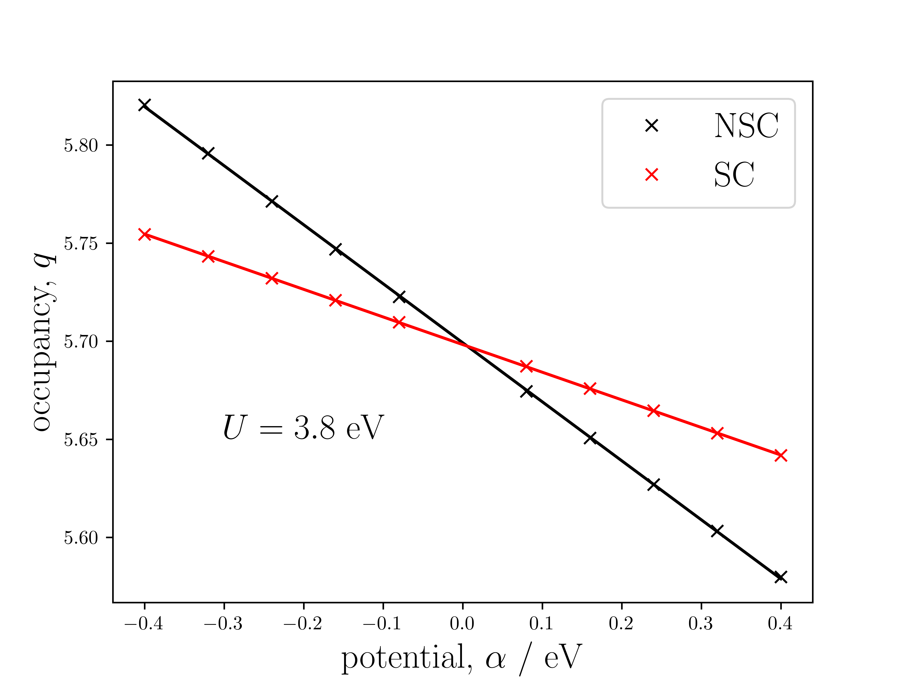

## What value of U should be used?
It is often difficult to answer the question: 'what value of $U$ should we use?'. One may typically systematically increase the value of $U$ until the known band gap of the material is achieved within some level of tolerance. This has two problems: the band gap of the material must be known experimentally, and only gives a lower bound for the true value of $U$. The following describes the method, introduced by Cococcioni and de Gironcoli[^1], that can deduce the value of U for a given ion in a system, exchange-correlation functional and choice of orbital basis.

## Determination of U via a Linear Response method
### Theory
Cococcioni and de Gironcoli begin with a constrained functional outlined by Dederichs _et al_.[^2], which depend on $\left\{n_{I}\right\}$ as input. In practical calculations, the occupancies are obtained as output and cannot be manually controlled. As a result, Cococcioni and de Gironcoli perform a Legendre transform to obtain a functional of Lagrange multipliers, $\left\{\alpha_{I}\right\}$,

$$ E\left[\left\{\alpha_{I}\right\}\right]=\min_{n\left(\mathbf{r}\right)}\bigg\{E_{\mathrm{DFT}}\left[n\left(\mathbf{r}\right)\right]+\sum_{I}\alpha_{I}n_{I}\bigg\}. $$

The energy as a functional of the atomic occupations is recovered by,

$$ E\left[\left\{n_{I}\right\}\right]=E\left[\left\{\alpha_{I}\right\}\right]-\sum_{I}\alpha_{I}n_{I}. $$

An additional potential of $\alpha_{I}$ arises on each respective ion's angular momentum components of the wavefunction. Depending on the sign of $\alpha_{I}$, the value of $n_{I}$ will increase or decrease. This response is defined as,

$$ \chi_{IJ}=\frac{\partial n_{I}}{\partial\alpha_{J}}\equiv-\frac{\partial^{2}E\left[\left\{n_{K}\right\}\right]}{\partial\alpha_{J}\partial\alpha_{I}}. $$

The response of the non-interacting system, $\boldsymbol{\chi}_{0}$, (i.e one where we do not allow the perturbed electronic structure to re-hybridise) does not represent electron-electron interactions and is therefore subtracted away from $\boldsymbol{\chi}$. The Hubbard U parameter is the difference between the response and its non-interacting contribution,

$$ \label{eq:U} U_{I}=-\left[\boldsymbol{\chi}^{-1}-\boldsymbol{\chi}_{0}^{-1}\right]_{II}. $$

The goal is therefore to collect the occupancies for all Hubbard ions in the cell where only one has $\alpha_{I}\neq0$ at a time. The occupancy of the ion with $\alpha_{I}\neq0$ will typically be most affected, then slightly less for those close in spatial proximity and minimally for those far away.

### In practice

1) A base calculation ($\alpha_{I}=0\;\forall\;I$) is performed and the electronic wavefunction and density stored.

For every unique ion where the Hubbard U values is requested, the following two calculations are performed for each of $\left\{\alpha_{I}\right\}$:

2) Starting from the base density, a non-self consistent (NSC) calculation (constant density) to obtain $\left\{n_{I}\right\}$.

3) Starting from 2), a self consistent (SC) calculation (varying density) to obtain $\left\{n_{I}\right\}$.

Equivalent ions that are not computed on can have their occupancies can be determined through symmetry. The chosen values of $\left\{\alpha_{I}\right\}$ are small and both positive and negative. In $\mathrm{eV}$ for example, $-0.3$ to $0.3$ in $0.1$ increments (excluding $0$). From least squares linear fittings of $\left\{n_{I}\right\}$ versus $\left\{\alpha_{I}\right\}$, the response matrices can be determined and U obtained as outlined in the equations above.

One would typically expect to obtain linear plottings similar to the following:

|  |
| :--: |
| The linear response plots for the occupancy of the d states of Mn in MnO. The two NSC (non-self-consistent, no electronic rehybridisation) and SC (self-consistent, electronic rehybridisation) occupancies meet at the origin where $\alpha=0$ as both represent the base ground state occupancies. |

## Further considerations
### Supercell convergence
In principle, the $U$ value should be calculated from the variation of a single site in an infinite crystal. In practice, a supercell approach is adopted to approximate this. A systematic approach should be taken, whereby the size of the supercell is increased until the $U$ value obtained changes less than a given level of tolerance - perhaps $0.1$ eV, for example.

### Charge neutrality
In their original paper outlining the linear response method for the calculation of the Hubbard U parameter, Cococcioni and de Gironcoli noted that enforcing charge neutrality explicitly in the response matrices, reduces the interaction of ions with their periodic images. This can help speed up the convergence of the calculated U parameters with respect to the supercell size. In practice, this is performed by creating one more row and column in $\boldsymbol{\chi}$. The ($N+1$)$^{\text{th}}$ row values enforce overall charge neutrality of the system for all perturbations,

$$ \chi_{(N+1)J}=-\sum_{I=1}^{N}X_{IJ}, $$

and the values for the ($N+1$)\textsuperscript{th} column enforce no charge density variation from a constant potential,

$$ \chi_{I(N+1)}=-\sum_{J=1}^{N}X_{IJ}. $$

Before computing the values of $\chi_{(N+1)(N+1)}$, one must ensure to have computed all row and column relations up to elements $N(N+1)$ and $(N+1)N$, respectively. The $(N+1)(N+1)$ element is then calculable via either the row _or_ column relation. Mathematically, the matrices gain a null eigenvalue, meaning that their inverses must be calculated carefully. One must use the Moore-Penrose pseudo-inverse to correctly recover their values. The procedure requires a singular value decomposition (SVD) method as the rows/columns of the matrices are no longer linearly independent when imposing the charge neutrality constraints. Despite the inverse of the linear response matrix now being ill-defined, the difference between the interacting and non-interacting cases them is valid. The use of the pseudo-inverse should therefore not introduce any additional numerical error to the calculation, other than the convergence tolerance required in the SVD method.

### Determination of U with DFT+U
One may require the application of a $U$ value to recover a reasonable ground state system, and thus the question is posed as to how best combine the input $U$ and computed $U$. The resultant $U$ is not trivial. Some literature state to sum the two, whereas other studies call for more nuanced approach. See Kulik _et al_.[^3] or Shishkin and Sato[^4] for further discussion.

[^1]: M. Cococcioni and S. de Gironcoli, Phys. Rev. B 71, 035105
[^2]: P. H. Dederichs _et al_., Phys. Rev. Lett. 53, 2512
[^3]: H. J. Keulik _et al_., Phys. Rev. Lett. 97, 103001
[^4]: M. Shishkin and H. Sato, Phys. Rev. B 93, 085135
