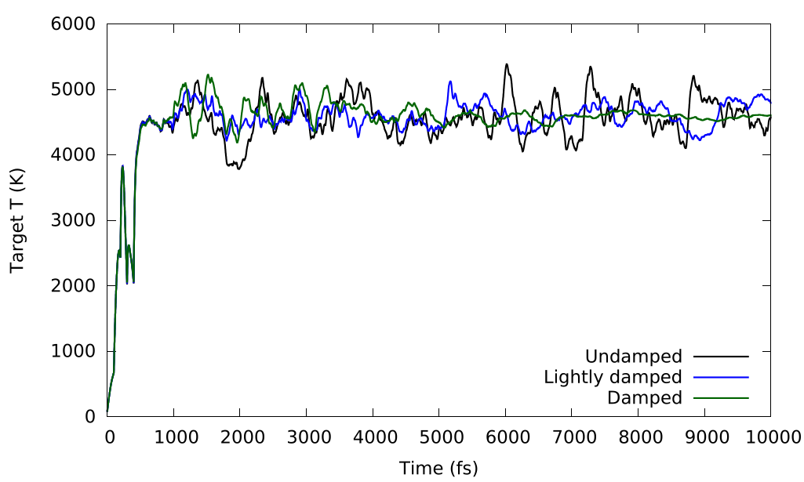
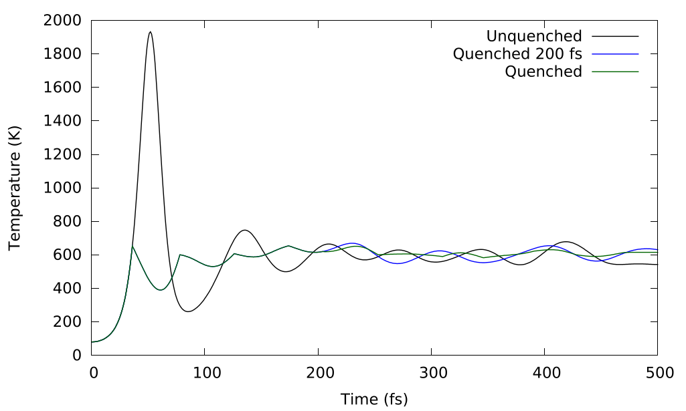
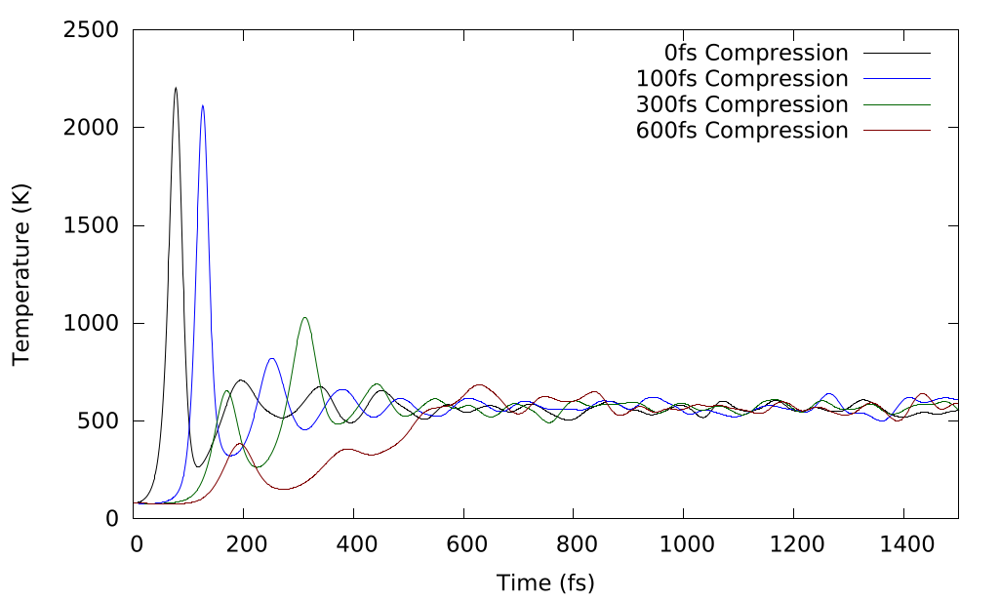

# Hugoniostat

The Hugoniostat is an approach to simulate shock-waves in DFT through a pseudo-ensemble which drives the temperature and
pressure to the point on the Hugoniot line. Two Hugoniotstat methods are implemented. The constant volume
Hugoniostat (NVHug) of Maillet *et al.*[^1] and the constant pressure/stress Hugoniostat of Ravelo
*et al.*[^2]

The NVHug and NPHug algorithms are a form of pseudo-ensemble which means that the do not strictly conserve a formal
quantity, but drive the system into a desired state.

The algorithms are implemented as other CASTEP ensembles and use many of the common [MD keywords](keywords.md) and can
function with with any of the standard CASTEP thermostat methods (see [basics](basics.md)).

Details of extended Hugoniostat methods can be found in the PhD thesis[^3] where the methods were
initially implemented in CASTEP.

## Hugoniot Equation of State

The Hugoniot describes the shocked state of the system


$$
\text{Mass:} \qquad{}\quad{}~~\,\rho{}_{1}u_{1} = \rho{}_{2}u_{2}
$$

$$
\text{Momentum:} \qquad{} \rho{}u_{1}^{2} + P_{1} = \rho{}u_{2}^{2} + P_{2}
$$

$$
\text{Energy:} \qquad{} h_{1} + \tfrac{1}{2}u_{1}^{2} =  h_{2} + \tfrac{1}{2}u_{2}^{2}
$$

where subscript $1$ and $2$ refer to the states ahead and behind the shock-front, $\rho{}$ is the mass density of the
fluid, $u$ is the fluid velocity, $P$ is the pressure and $h$ is the specific enthalpy (per unit mass). It can also be
formulated in terms of the shock speed:

$$
\text{Mass:} \qquad{}\rho{}_{1}u_{s} = \rho{}_{2}(u_{s} - u_{2})
$$

$$
\text{Momentum:} \qquad{} P_{2}-P_{1} = \rho{}_{2}u_{2}(u_{s}-u_{2}) = \rho{}_{1}u_{s}u_{2}
$$

$$
\text{Energy:} \qquad{} P_2\,u_2  = \rho{}_{1}u_{s}(\tfrac{1}{2}u_{2}^{2} + e_{2} - e_{1})
$$

where $u_{s}$ is the shock speed and $e$ is the specific internal energy. Using substitutions of the mass conservation
& momentum conservation into the energy conservation it is possible to derive the Hugoniot equation:

$$
e_{2} - e_{1} = \tfrac{1}{2}(P_{1} + P_{2})(\rho{}_{1}^{\text{-}1}-\rho{}_{2}^{\text{-}1}),
$$

which in the per-unit-mass basis gives us:

$$
e_{2} - e_{1} = \tfrac{1}{2}(P_{1} + P_{2})(V_{1}-V_{2}),
$$

## NVHug

The NVHug method performs a static cell calculation at a compression ratio of `md_hug_compression` in the direction
specified by `md_hug_dir` (by default `ISO`tropic).

The equations of motion that govern NVHug are (in the Nose-Hoover formulation):

$$
\dot{\textbf{r}}_{i} = \frac{\textbf{p}_{i}}{m_{i}},
$$

$$
\dot{\textbf{p}}_{i} = \textbf{F}_{i} - \nu{}\chi{}\textbf{p}_{i},
$$

$$
\dot{\chi{}} = \frac{\nu{}}{C}(E(t) - E_{H}(t)),
$$

where $\chi{}$ is the heat-flow of the thermostat into the system, $\nu{}$ is the coupling between the thermostat and
the system, $C$ is a scaling constant in units of energy to conserve system size independence and

$$
E_{H}(t) = E(t_{0}) + \tfrac{1}{2}(P(t) + P(t_{0})(V(t_{0}) - V(t))
$$

where $t_{0}$ is the time before the system has been compressed (i.e. the equilibrium state), we deem the deviation of our current state from the Hugoniot state the Hugoniot estimator:

$$
E(t) - E_{H}(t) = E(t) - E(t_{0}) - \tfrac{1}{2}(P(t) + P(t_{0}))(V(t_{0}) - V(t)).
$$

#### Example

##### `.param`

```
task             : molecular dynamics

md_ensemble      : HUG
md_hug_dir       : ZDIR
md_hug_method    : NVHug
md_temperature   : 70 K
md_thermostat    : langevin
md_hug_t         : 10 fs
md_ion_t         : 50 fs
md_delta_t       : 1 fs
md_eqm_t         : 500 fs
md_num_iter      : 1000
md_hug_compression : 0.7

```

## NPHug

The equations of motion that govern the NPHug Hugoniostat (in the Nose-Hoover formulation) are:

$$
\dot{r}_{\alpha{}i} = \frac{p_{\alpha{}i}}{m_{i}} + \nu{}_{P}\eta{}_{\alpha{}}r_{\alpha{}i},
$$

$$
\dot{p}_{\alpha{}i} = F_{\alpha{}i} - (\nu{}_{p}\eta{}_{\alpha{}} - \nu{}_{H}\chi{})p_{\alpha{}i},
$$

$$
\dot{h}_{\alpha{}\alpha{}}     = \nu{}_{p}\eta{}_{\alpha{}}h_{\alpha{}\alpha{}},
$$

$$
\dot{\chi{}}      = \frac{\nu{}_{H}}{C}(E(t) - E_{H}(t)),
$$

$$
\dot{\eta{}}_{\alpha{}}      = \frac{\nu{}_{p}}{D}(P_{\alpha{}\alpha{}}(t) - \sigma{}_{\alpha{}\alpha{}}),
$$

where $\alpha{}$ refers to an element in the direction of a cell-vector $\vec{h}$, $\nu{}_{H}$ is the coupling of the
thermostat to the system, $\nu{}_{P}{}$ is the coupling of the barostat piston to the system, $\sigma{}$ is the
target pressure tensor and $P$ is the instantaneous total pressure tensor, $D$ is a scaling constant in units of
pressure to conserve system size independence, Ravelo *et al*.[^2] suggest the equilibrium bulk modulus ($B_{0}$) .

#### Example

##### `.param`

```
task             : molecular dynamics

md_ensemble      : HUG
md_hug_dir       : ZDIR
md_hug_method    : NPHug
md_temperature   : 70 K
md_thermostat    : langevin
md_hug_t         : 10 fs
md_ion_t         : 50 fs
md_delta_t       : 1 fs
md_eqm_t         : 500 fs
md_num_iter      : 1000
```

##### `.cell`

```
...

%block external_pressure
GPa
0.0 0.0 0.0
0.0 0.0 0.0
0.0 0.0 10.0
%endblock external_pressure
```

## Accelerated Equilibration

Due to the nature of plane-wave density functional theory (DFT) calculations and the way in which the forces are
calculated, DFT can be very susceptible to rapid changes in structure and can become unstable at extremely high
temperatures, and if atoms become close enough the fundamental assumptions of non-polarisability of core electrons
becomes invalid in DFT.

DFT is also expensive to calculate compared to the empirical force-fields, and so wasting as little calculation as
possible is essential. The accelerated equilibration methods exist to make the process of computing shockwaves faster
and more robust.

### Damping

Ravelo *et al*.[^2] suggested applying damping to the "velocity" of the thermo-/barostats preventing the over-shoot of
the ideal Hugeoniot values. This makes the thermostat NVHug formulation:

$$
\dot{\chi{}} = \frac{\nu{}_{H}}{C}(E(t) - E_{H}(t)) - \beta{}_{H}\chi{},
$$

and similarly for the update equation of motion of the NPHug formulation:

$$
\dot{\eta{}}_{\alpha{}} = \frac{\nu{}_{p}}{D}(P_{\alpha{}\alpha{}}(t) - \sigma{}_{\alpha{}\alpha{}}) - \beta{}_{p}\eta{},
$$

where $\beta{}_{H}$ and $\beta{}_{p}$ are user-defined damping coefficients for the heat-flow and barostat piston respectively, chosen to bring about critical damping to the Hugoniot state.

#### Related Keywords

- `beta_t` : (Physical)

    Damping parameter for Hugoniostat temperature coupling in 1/fs

- `beta_h` : (Physical)

    Damping parameter for Hugoniostat pressure coupling in 1/fs

#### Examples

```
%block devel_code
md: BETA_T=0.1 BETA_H=0.1 :endmd # Lightly Damped
md: BETA_T=0.3 BETA_H=0.3 :endmd # Damped
%enblock devel_code
```



Effects of the damping on the Langevin scheme (Eq. 4.2) on a 500- atom Lennard-Jones cell at 60% volume with an overly
strong Hugoniostat coupling ($\nu{}_{H}$) of $0.1fs^{−1}$ and a damping factor ($\beta{}_{H}$) of (Undamped) 0.0,
(Lightly Damped) 0.1, (Damped) 0.3.

### Quenching

Quenching is a more extreme version of damping where upon the "acceleration" of the thermo-/barostat changing sign, the
"velocity" is reset to 0. Because this is not directly coupled to the system this does not damage the internal dynamics
of the system and can lead to faster convergence and more stable temperatures. Particularly in the initial phases of
NVHug where upon initial compression temperatures and pressures can spike.

Quenching only takes place during the equilibration phase as determined by [`md_eqm_t`](keywords.md)

#### Related Keywords

- `quench_t` : (Logical)

    Quench thermostat velocity upon changing direction for rapid equilibration

- `quench_p` : (Logical)

    Quench barostat velocity upon changing direction for rapid equilibration

#### Examples

```
%block devel_code
md: QUENCH_T=T :endmd # Quench Thermostat
md: QUENCH_P=T :endmd # Quench Barostat
%enblock devel_code
```



The effects of quenching on the temperature of a 70% volume 500-atom Lennard-Jones system, unquenched line (black)
shows a large tran- sient initially, the quenched lines (blue and green) show the elimination of this transient at the
expense of “unphysical” temperature dynamics, which are eliminated when the quenching is turned off (blue) after
equilibration. It should be noted that all three converge to the same temperature.

### Steady compression

Steady compression spreads the system compression in NVHug compression over a period of time rather than compressing
instantaneously to allow the system to equilibrate more steadily and avoid transient temperature and pressure
spikes. This was also proposed in Ravelo *et al*.[^2] as a means of smoothing equilibration.

k-points and wavefunction samples are determined from the compressed cell so that the NVHug can be more efficient for
the majority of the run.

`compression_t` and `compression_rate` are two different ways of specifying the same thing either as `%/fs` or
`fs/%`. When the compression has reached the target compression the compression will stop. For steady compression, it is
generally best to compress the system for slightly less time than the equilibration period to ensure that the system is
in a valid steady state before measuring data.

`compression_block` gives the system time to equilibrate between compressions by compressing every `compression_block`
steps rather than every step (though the compression at each compression step will be larger s.t. `compression_rate` and
`compression_t` are preserved).

#### Relevant Keywords

- `compression_t` : (Physical)

    Time over which the compression should take place for pressure ramping in $fs$.

- `compression_rate` : (Physical)

    Rate of decrease of cell volume as $\tfrac{\%}{fs}$.

- `compression_block` : (Integer)

    Number of steps between cell compressions to steadily ramp up pressure.

#### Examples

```
md_eqm_t: 600fs

%block devel_code
md: compression_t=400 :endmd
%enblock devel_code
```


Effect of steady compression on reducing initial transients during equilibration.

## Predictor-corrector (Experimental)

Due to the nature of DFT, where a lot of important properties (e.g. wavefunctions) are tied to the simulation cell, it
is generally more efficient to use a fixed-cell calculation in order to reduce the computational expense of
recalculating all the properties which are related to the cell. This means that using NVHug is generally more efficient
in CASTEP, however, we are usually more interested in sampling particular pressures on the Hugoniot rather than the
effect of a given compression.

The predictor-corrector attempts to mitigate these issues by using past measures on the Hugoniot curve to automatically
trace out the Hugoniot curve up to a given pressure with a series of NVHug simulations.

It uses the previous `hist_len` points to fit a curve and predict what compression would give the target pressure and
run it. Tracing out the Hugoniot to `target_p` in either `steps` steps or steps of size `pstep`. E.g.

```
pc:
target_p=10
steps=2
:endpc
```
Will target 5 and 10GPa
```
pc:
target_p=10
pstep=2
:endpc
```
will target 2, 4, 6, 8 and 10GPa

`err` determines how close the actual pressure must be to the target to be accepted, relative to the actual target. E.g.
```
pc:
target_p=10
err=0.1
:endpc
```
Will accept any calculation whose final Hugoniot $P$ is between 9-11GPa as complete and move to the next target.

The `reuse` keyword causes the P-C to use the final state of the previous step as the initial state of the
current. Including temperature/pressure and atomic positions to speed up the equilibration process.

`max_delta` limits the compression step the P-C can take between stages to ensure that initial steps, where estimates
are limited by lack of datapoints, in very stiff materials do not result in extreme temperature or pressure jumps where
fundamental assumptions of DFT may break down and cause the system to fail.

#### Related Keywords

- `pc` : (Logical)

     Use predictor-corrector algorithm to attempt to trace the Hugoniot line automatically.

- `reuse` : (Logical)

     Reuse previous compression's final state as the next steps initial state.

- `max_delta` : (Physical)

     Maximum attempted compression step difference for P-C in GPa

- `err` (Physical)

     Permitted difference between attained and target considered accepted

- `target_p` : (Physical)

     Highest target pressure for P-C to reach in GPa

- `pstep` : (Physical)

     Reach `target_p` in steps of approximately `pstep` GPa

- `steps` : (Integer)

     Reach `target_p` in approximately `steps` steps

- `method` : (LIN, POLY, EXP)

     Equation form to use for predictor corrector estimation, `POLY`nomial is recommended.

- `poly_order` : (Integer)

     Polynomial order used in `POLY`nomial method

- `hist_len` : (Integer)

     Length of history to keep


#### Examples

```
PC: PC=T TARGET_P=1.0 STEPS=2 METHOD='LIN' AV_METHOD='RUNAV' :ENDPC
```

## Keywords Summary

### Param Keywords

* `md_ensemble`:

    Should be set to `HUG` to use Hugoniostat methods.

* `md_hug_method` : (NONE, NVHUG, NPHUG)

    Hugoniostat method. (default: NONE)

* `md_hug_dir` : (XDIR, YDIR, ZDIR, ISO)

    Hugoniostat compression direction. (default: ISO)

* `md_hug_t` : (Physical)

    Hugoniostat coupling constant.

* `md_hug_compression` : (Physical)

    Hugoniostat compression ratio $\frac{V}{V_{0}}$. Values from 0.0 to 1.0 (default)

### Devel Code Parameters

#### MD Block

- `chem_pot` : (Physical)

    Manually specify total chemical potential (scaling factor) in eV

##### Equilibration Acceleration

- `quench_t` : (Logical)

    Quench thermostat velocity upon changing direction for rapid equilibration

- `quench_p` : (Logical)

    Quench barostat upon changing direction for rapid equilibration

- `eqm_hug_t` : (Physical)

    Hugoniostat coupling during equilibration phase in 1/fs

- `beta_t` : (Physical)

    Damping parameter for Hugoniostat temperature coupling in 1/fs

- `beta_h` : (Physical)

    Damping parameter for Hugoniostat pressure coupling in 1/fs

- `compression_t` : (Physical)

    Time over which the compression should take place for pressure ramping in $fs$.

- `compression_rate` : (Physical)

    Rate of decrease of cell volume as $\tfrac{\%}{fs}$.

- `compression_block` : (Integer)

    Number of steps between cell compressions to steadily ramp up pressure.

##### Running Averages

- `ra_len` : (Integer)

    Number of running average steps to use in calculating final Hugoniot

- `av_method` : (CUMAV, RUNAV, DIRCT, FINAL)

    Method for computing Hugoniot to dump to `.hug` file.

##### Initial States

- `ma_init_t` : (Logical)

    Use Maillet hugoniostat temperature estimator as initial temperature.

- `init_eta` : (Physical)

    Initial $\eta{}$ (cell compression velocity) for NPHug in $\tfrac{A}{fs}$.

- `temp_init` : (Physical)

    Initial temperature to be used for each hug stage (overriding `md_temperature` each stage in P-C) in $K$.

#### PC Block

- `pc` : (Logical)

     Use predictor-corrector algorithm to attempt to trace the Hugoniot line automatically.

- `reuse` : (Logical)

     Reuse previous compression's temperature as initial temperature rather than `md_temperature`

- `max_delta` : (Physical)

     Maximum attempted pressure step difference for P-C in GPa

- `err` (Physical)

     Permitted difference between attained and target considered accepted

- `target_p` : (Physical)

     Highest target pressure for P-C to reach in GPa

- `pstep` : (Physical)

     Reach `target_p` in steps of approximately `pstep` GPa

- `steps` : (Integer)

     Reach `target_p` in approximately `steps` steps

- `method` : (LIN, POLY, EXP)

     Equation form to use for predictor corrector estimation, `POLY`nomial is recommended.

- `poly_order` : (Integer)

     Polynomial order used in `POLY`nomial method

- `hist_len` : (Integer)

     Length of history to keep


[^1]: J.-B. Maillet, M. Mareschal, L. Soulard, R. Ravelo, P. S. Lomdahl, T. C. Germann, and B. L. Holian. Uniaxial hugoniostat: A method for atomistic simulations of shocked materials. *Phys. Rev. E*, 63:016121, Dec 2000.
[^2]: R. Ravelo, B. L. Holian, T. C. Germann, and P. S. Lomdahl. Constant-stress hugoniostat method for following the dynamical evolution of shocked matter. *Phys. Rev. B*, 70:014103, 2004.
[^3]: J.S. Wilkins. Exploration of approaches to shock-wave simulations. PhD thesis, University of York, York, 2019.
