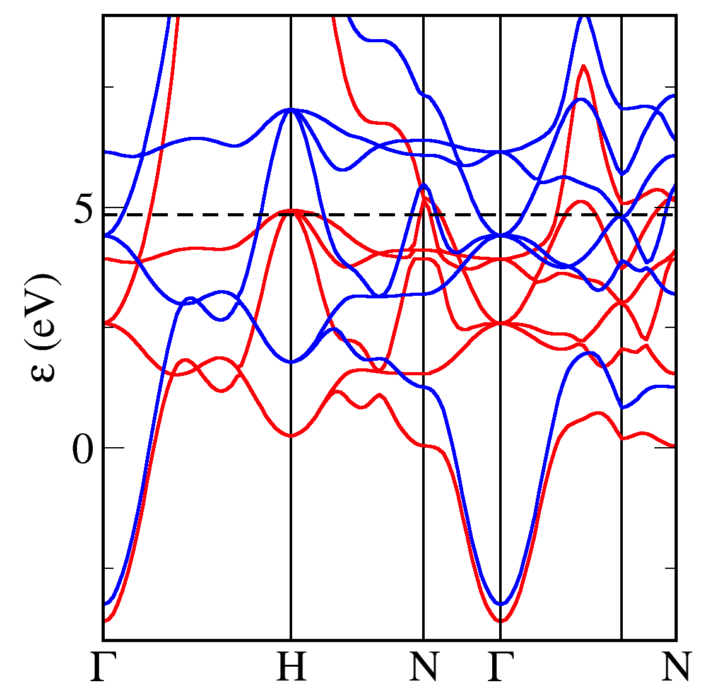

## Iron 

```
! Fe.cell
%BLOCK LATTICE_CART
      -1.433199999999999       1.433200000000001       1.433200000000001
       1.433200000000001      -1.433200000000000       1.433200000000000
       1.433200000000000       1.433200000000000      -1.433200000000000
%ENDBLOCK LATTICE_CART

%BLOCK POSITIONS_FRAC
 Fe   0.0000000000000000   0.0000000000000000   0.0000000000000000
%ENDBLOCK POSITIONS_FRAC

symmetry_generate

! Kpoint grid for the Groundstate (SCF) calculation
kpoint_mp_grid 8 8 8

! kpoint path through the Brillouin Zone for the Bandstructure
%BLOCK spectral_KPOINT_PATH
0.0 0.0 0.0 !G    
0.5 0.5 0.5 !H           
0.5 0.0 0.0 !N           
0.0 0.0 0.0 !G          
0.75 0.25 -0.25 !P       
0.5 0.0 0.0     !N
%ENDBLOCK spectral_KPOINT_PATH
```
In the param file we set `spin_polarised  true` in order to allow the up and down spin electrons to take different configurations. It is important to start the calculation with an initial spin density using e.g. `spin:   1`. The value of the initial spin should not affect the final answer - a non-zero value is just needed to break the symmetry between the spin channels.
```
! Fe.param
task            spectral      ! The TASK keyword instructs CASTEP what to do
spectral_task   bandstructure !
xc_functional   LDA           ! Which exchange-correlation functional to use.
cut_off_energy  500 eV        !
grid_scale      2.0           !
opt_strategy    speed         ! Choose algorithms for best speed
spin            1             ! Set the spin in the original cell to 1.
spin_polarised  true          ! Run a spin polarised calculation
spectral_nbands       6       ! number of bands to compute during the BS run
```
At the end of the calculation the net spin of the unit cell is reported in the `castep` file e.g.
```
Integrated Spin Density     =     2.15322     hbar/2    
```



!!! note
     The band structure has similarities with that of Copper - and other 3d elements - with flat 3d bands and dispersive s bands. We colour code the bands according to their spin chactacter (red=up, blue=down). We can see that there is an almost constant exchange splitting of 1.5eV between the up and down 3d bands. The splitting between the s-like bands is much smaller. More up states lie below the fermi energy than down states - hence the net spin of the unit cell.


## FeO

FeO is an anti-ferromagnetic oxide. We set up the calculation with initial spins on the two Fe atoms pointing in opposite directions.

```
! FeO.cell
%BLOCK LATTICE_CART
       1.768531594289456       0.000000000000001       5.002162732258922
      -0.884265797144728       1.531593288050063       5.002162732258921
      -0.884265797144728      -1.531593288050063       5.002162732258922
%ENDBLOCK LATTICE_CART                  

%BLOCK POSITIONS_FRAC
  O   0.75   0.750  -1.250
  O  -0.75  -0.750   1.250           
 Fe   0.00   0.000  -0.000 spin=-4.0
 Fe   1.50  -0.500  -0.500 spin=4.0
%ENDBLOCK POSITIONS_FRAC

kpoints_mp_grid: 6 6 6

symmetry_generate

%block spectral_kpoint_path
0.500 0.500 0.000
0.000 0.000 0.000
0.500 0.500 0.500
0.000 0.500 0.000
0.000 0.000 0.000
%endblock spectral_kpoint_path
```
```
! FeO.param
task           : spectral     ! The TASK keyword instructs CASTEP what to do
xc_functional  : PBE          ! Which exchange-correlation functional to use.
cutoff_energy   600 eV        
opt_strategy    speed         ! Choose algorithms for speed.
nextra_bands : 6
spin_polarized : true
```

A PBE calculation incorrectly finds FeO to be a metal (bandstructure on left below).

Add the following to the cell file to run a PBE+U calculation
```
%block hubbard_u
Fe 1 d: 2.5
Fe 2 d: 2.5
%endblock hubbard_u
```


*FeO band structure with PBE (left) and with PBE+U (right)*

!!! note
     Adding a Hubbard U term to the calculation opens the band gap and FeO is (correctly) predicted to be an antiferromangetic insulator.
