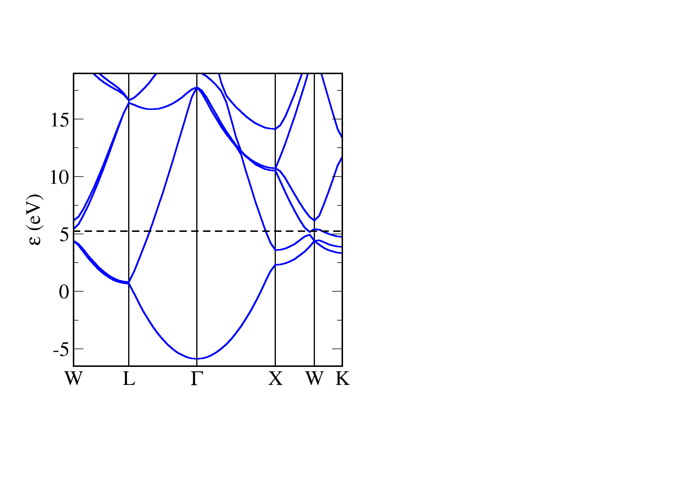
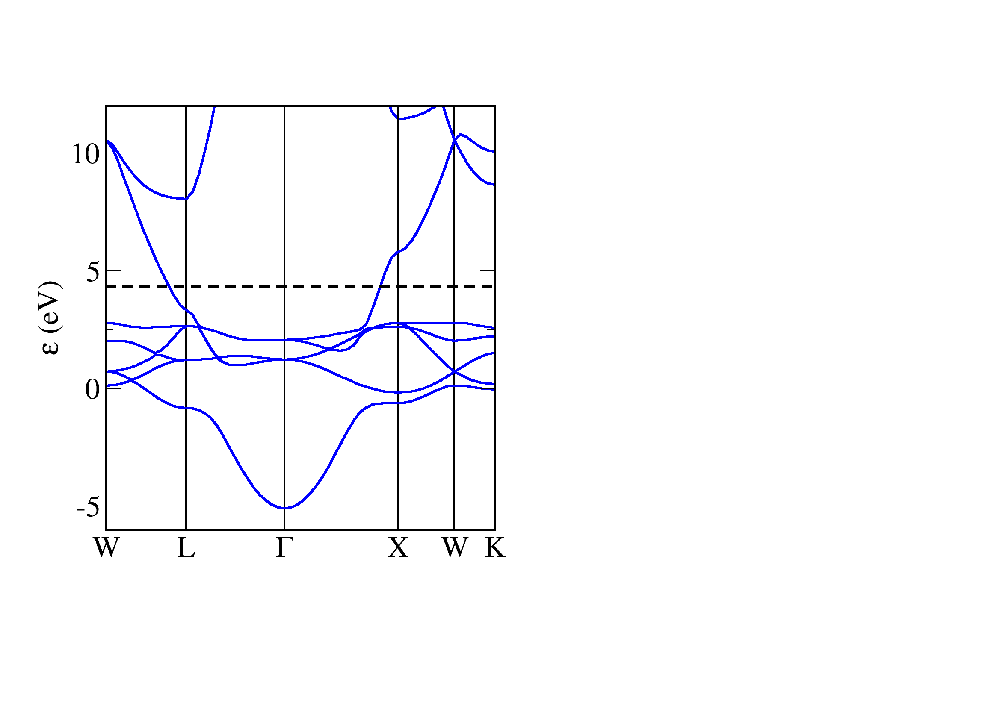

Here we use CASTEP to calculate the bandstructure of two typical metals. The cell and param files are very similar to the semiconductor examples - the one difference is that we use a finer sampling of the Brillouin Zone with the keyword `kpoint_mp_grid`. A finer sampling is needed to correctly represent the change in occupancy at the Fermi energy.
## Aluminium

```
! Al.cell
%BLOCK LATTICE_ABC
2.86 2.86 2.86
60 60 60
%ENDBLOCK LATTICE_ABC

%BLOCK POSITIONS_ABS
Al     0   0   0
%ENDBLOCK POSITIONS_ABS

kpoint_mp_grid 12 12 12

%block spectral_kpoint_path
0.5 0.25 0.75    ! W
0.5 0.5 0.5      ! L
0.0 0.0  0.0     ! Gamma
0.5 0.0 0.5      ! X
0.5 0.25 0.75    ! W
0.375 0.375 0.75 ! K
%endblock spectral_kpoint_path

symmetry_generate
```


```
! Al.param
task            spectral      ! The TASK keyword instructs CASTEP what to do
spectral_task   bandstructure !
xc_functional   LDA           ! Which exchange-correlation functional to use.
cut_off_energy  500 eV        !
opt_strategy    speed         ! Choose algorithms for best speed
```



!!! note
    Aluminium is a metal - there is no gap energy between the occupied and unoccupied states. The bands are close to parabolic (this is particularly noticeable around Gamma) - the electronic structure of aluminium closely follows a nearly-free electron model.

## Copper

```
! Cu.cell
%BLOCK LATTICE_ABC
2.55 2.55 2.55
60 60 60
%ENDBLOCK LATTICE_ABC

%BLOCK POSITIONS_ABS
Cu     0   0   0
%ENDBLOCK POSITIONS_ABS

kpoint_mp_grid 12 12 12

%block spectral_kpoint_path
0.5 0.25 0.75    ! W
0.5 0.5 0.5      ! L
0.0 0.0  0.0     ! Gamma
0.5 0.0 0.5      ! X
0.5 0.25 0.75    ! W
0.375 0.375 0.75 ! K
%endblock spectral_kpoint_path

symmetry_generate
```

```
! Cu.param
task            spectral      ! The TASK keyword instructs CASTEP what to do
spectral_task   bandstructure !
xc_functional   LDA           ! Which exchange-correlation functional to use.
cut_off_energy  500 eV        !
opt_strategy    speed         ! Choose algorithms for best speed at expense of memory.
spectral_nbands 8             !
```



!!! note
    Copper is a metal - there is no gap energy between the occupied and unoccupied states. The bandstructure of copper is typical for a transition metal - we have highly dispersive parabolic bands corresponding to the s electrons, these are crossed by 5 quite flat bands corresponding to more localised 3d electrons. In copper the 3d states are filled, and we see the flat bands lie below the Fermi level.
