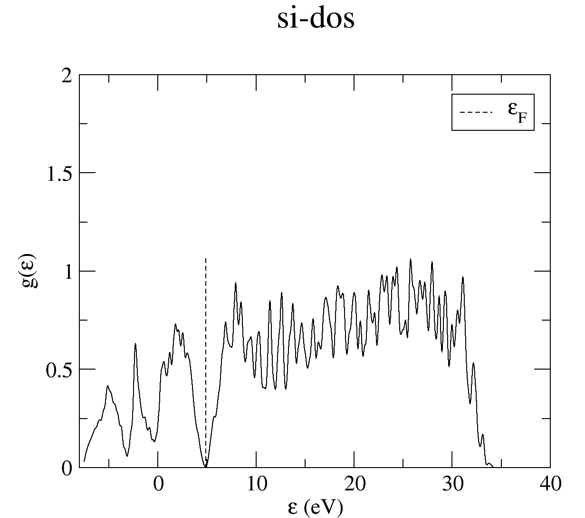

In this tutorial we will walk through plotting a bandstructure and density of states using the perl utilities supplied with CASTEP. We will use Xmgace for plotting - however, the scripts also support gnuplot.

## Bandstructure

Here is a cell file. You can use the icon in the top right of the box to copy and paste the text. Save it in a file `si-bands.cell`

```
%block lattice_abc
3.8 3.8 3.8
60 60 60
%endblock lattice_abc
!
! Atomic co-ordinates for each species.
! These are in fractional co-ordinates wrt to the cell.
!
%block positions_frac
Si 0.00 0.00 0.00
Si 0.25 0.25 0.25
%endblock positions_frac
!
! Analyse structure to determine symmetry
!
symmetry_generate
!
! Specify M-P grid dimensions for electron wavevectors (K-points)
!
kpoint_mp_grid 4 4 4

! Specify a path through the Brillouin Zone to compute the band structure.
!
%block spectral_kpoint_path
0.5 0.25 0.75    ! W
0.5 0.5 0.5      ! L
0.0 0.0  0.0     ! Gamma
0.5 0.0 0.5      ! X
0.5 0.25 0.75    ! W
0.375 0.375 0.75 ! K
%endblock spectral_kpoint_path
```

Here is a param file. You can use the icon in the top right of the box to copy and paste the text. Save it in a file `si-bands.param`

```
task            spectral      ! The TASK keyword instructs CASTEP what to do
spectral_task   bandstructure !
xc_functional   LDA           ! Which exchange-correlation functional to use.
cut_off_energy  500 eV        !
opt_strategy    speed         ! Choose algorithms for best speed
```

We can then run castep and use the tool `dispersion.pl` to plot a bandstructure with Xmgrace. To see all of the functionality run 'dispersion.pl -h'

```
castep si-bands
dispersion.pl -sym fcc -xg si-bands.bands
```
You should get a plot


## Density of States

Here is a cell file. It is the same as a bandstructure cell file except we have replaced the path through the Brillioun zone with a regular grid of k-points. You can use the icon in the top right of the box to copy and paste the text. Save it in a file `si-dos.cell`

```
%block lattice_abc
3.8 3.8 3.8
60 60 60
%endblock lattice_abc
!
! Atomic co-ordinates for each species.
! These are in fractional co-ordinates wrt to the cell.
!
%block positions_frac
Si 0.00 0.00 0.00
Si 0.25 0.25 0.25
%endblock positions_frac
!
! Analyse structure to determine symmetry
!
symmetry_generate
!
! Specify M-P grid dimensions for electron wavevectors (K-points)
!
kpoint_mp_grid 4 4 4

! Specify a uniform sampling of the Brillouin Zone
!
spectral_kpoint_mp_grid 17 17 17
```

Here is a param file. You can use the icon in the top right of the box to copy and paste the text. Save it in a file `si-dos.param`

```
task            spectral      ! The TASK keyword instructs CASTEP what to do
spectral_task   dos           !
xc_functional   LDA           ! Which exchange-correlation functional to use.
cut_off_energy  500 eV        !
opt_strategy    speed         ! Choose algorithms for best speed
```

We can then run castep and use the tool `dos.pl` to plot a bandstructure with Xmgrace. To see all of the functionality run 'dos.pl -h'

```
castep si-dos
dos.pl -xg si-dos.bands -w 0.3
```
You should get a plot like



!!! Note
    The procedure above is inefficient as we computed the groundstate of the system twice, once when computing the bandstructure and again when computing the dos. To avoid this we could put the following line in the si-dos.param file `continuation: si-bands.check`. This will restart the calculation of the dos using the previously computed groundstate.
