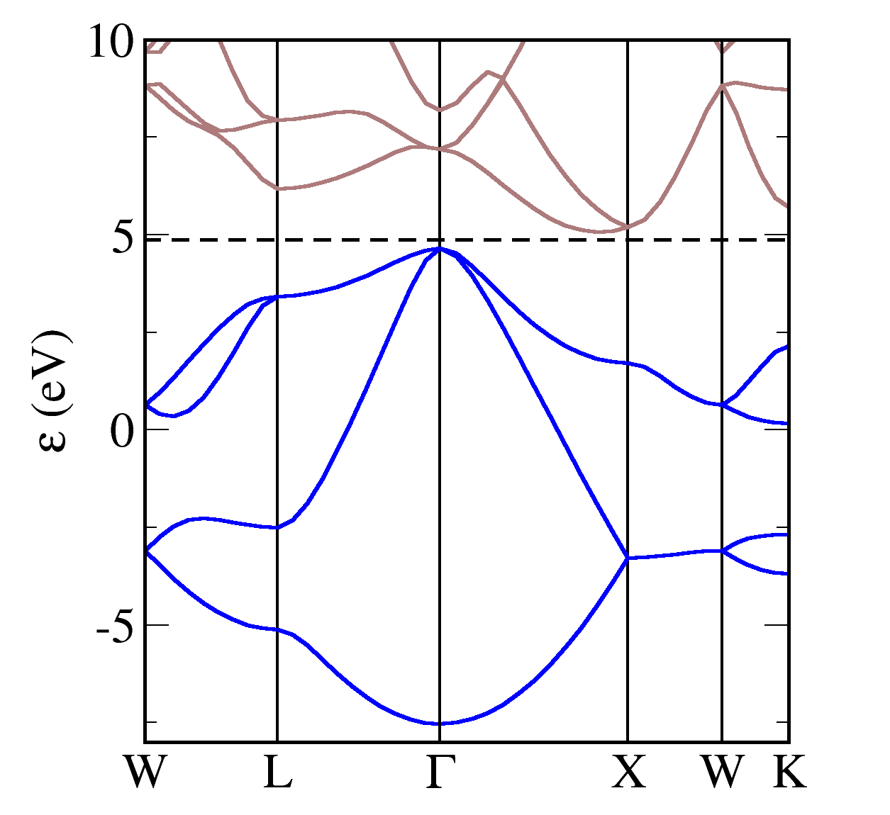
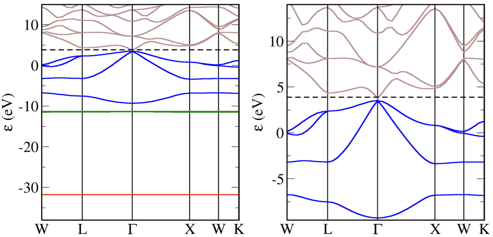

In this tutorial we will show you the cell and param files needed to plot bandstructures and density of states plots for various materials. For the commands needed to make the plots refer to to earlier tutorials.

## Silicon

```
%block lattice_abc
3.8 3.8 3.8
60 60 60
%endblock lattice_abc
!
! Atomic co-ordinates for each species.
! These are in fractional co-ordinates wrt to the cell.
!
%block positions_frac
Si 0.00 0.00 0.00
Si 0.25 0.25 0.25
%endblock positions_frac
!
! Analyse structure to determine symmetry
!
symmetry_generate
!
! Specify M-P grid dimensions for electron wavevectors (K-points)
!
kpoint_mp_grid 4 4 4

! Specify a path through the Brillouin Zone to compute the band structure.
!
%block spectral_kpoint_path
0.5 0.25 0.75    ! W
0.5 0.5 0.5      ! L
0.0 0.0  0.0     ! Gamma
0.5 0.0 0.5      ! X
0.5 0.25 0.75    ! W
0.375 0.375 0.75 ! K
%endblock spectral_kpoint_path
```

```
task            spectral      ! The TASK keyword instructs CASTEP what to do
spectral_task   bandstructure !
xc_functional   LDA           ! Which exchange-correlation functional to use.
cut_off_energy  500 eV        !
opt_strategy    speed         ! Choose algorithms for best speed
```



!!! note
    Silicon is a semiconductor with a small gap between the occupied (blue) and unoccupied states (brown). The gap is indirect as the valence band maximum is as Gamma, but the conduction band minimum lies between Gamma and X.


## Gallium Arsenide

The cell file is almost identical to the silicon example above, except that the unitc cell length is slighly larger, and we have replaced one Si atom with Ga, and the other Si with As.
```
%block lattice_abc
4 4 4
60 60 60
%endblock lattice_abc
!
! Atomic co-ordinates for each species.
! These are in fractional co-ordinates wrt to the cell.
!
%block positions_frac
Ga 0.00 0.00 0.00
As 0.25 0.25 0.25
%endblock positions_frac
!
! Analyse structure to determine symmetry
!
symmetry_generate
!
! Specify M-P grid dimensions for electron wavevectors (K-points)
!
kpoint_mp_grid 4 4 4

! Specify a path through the Brillouin Zone to compute the band structure.
!
%block spectral_kpoint_path
0.5 0.25 0.75    ! W
0.5 0.5 0.5      ! L
0.0 0.0  0.0     ! Gamma
0.5 0.0 0.5      ! X
0.5 0.25 0.75    ! W
0.375 0.375 0.75 ! K
%endblock spectral_kpoint_path
```
The param file is unchanged from the Silicon example
```
task            spectral      ! The TASK keyword instructs CASTEP what to do
spectral_task   bandstructure !
xc_functional   LDA           ! Which exchange-correlation functional to use.
cut_off_energy  500 eV        !
opt_strategy    speed         ! Choose algorithms for best speed
```



!!! note
    GaAs is a semiconductor with a small gap between the occupied (blue) and unoccupied states (brown). The gap is direct both the valence band maximum  and conduction band minimum are at Gamma. Compared with Silicon we see that the original bandstructure contains low lying flat bands at around -32eV and -12eV. This is because both the Ga and As pseudopotentials include semi-core states in the valence. The red states are the As 3d and the green are the Ga 3d.
