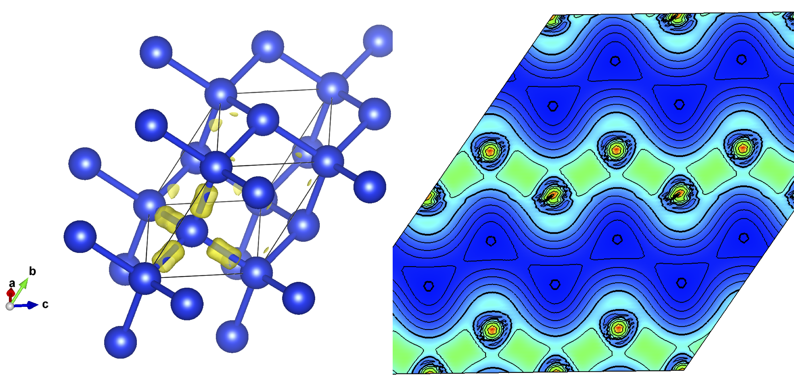

In this tutorial we will walk through plotting a charge density with Vesta https://jp-minerals.org/vesta/en/

## Silicon

Here is a cell file. You can use the icon in the top right of the box to copy and paste the text. Save it in a file `silicon.cell`

```
%block lattice_abc
3.8 3.8 3.8
60 60 60
%endblock lattice_abc
!
! Atomic co-ordinates for each species.
! These are in fractional co-ordinates wrt to the cell.
!
%block positions_frac
Si 0.00 0.00 0.00
Si 0.25 0.25 0.25
%endblock positions_frac
!
! Analyse structure to determine symmetry
!
symmetry_generate
!
! Specify M-P grid dimensions for electron wavevectors (K-points)
!
kpoint_mp_grid 4 4 4

```

Here is a param file. You can use the icon in the top right of the box to copy and paste the text. Save it in a file `silicon.param`

```
xc_functional : LDA
cutoff_energy : 1500 eV
#this next line causes the charge to be written in a den_fmt file
write_formatted_density : T  
spin_polarised : false
```
The cutoff energy is somewhat higher than needed for a converged total energy - but it helps when making a smoother looking charge density plot.

Run castep. You will see a file called `silicon.den_fmt` this contains the charge density in a formatted (i.e. a human readable, ASCII file). We need to change this file into a format Vesta can read. Copy it to a file called `silicon.charg_frm`

```
cp silicon.den_fmt silicon.charg_frm
```
Now edit the file `silicon.charg_frm` with a text editor to remove the first 11 lines. The file should now begin with `1 1 1` and a number. You can now open `silicon.charg_frm` with Vesta. Note that Vesta needs both the `cell` and `charge_frm` files to make a plot. If you are working on a remote machine you will need to copy both of these back to your local machine to view with Vesta. You can find a walkthrough video of this process at https://youtu.be/_c2Hk4jxmm4



An alternative way to plot charge densities (and much more besides) is c2x https://www.c2x.org.uk
