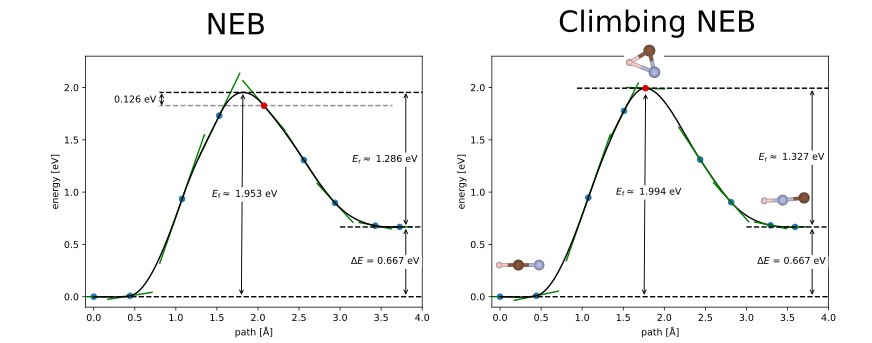
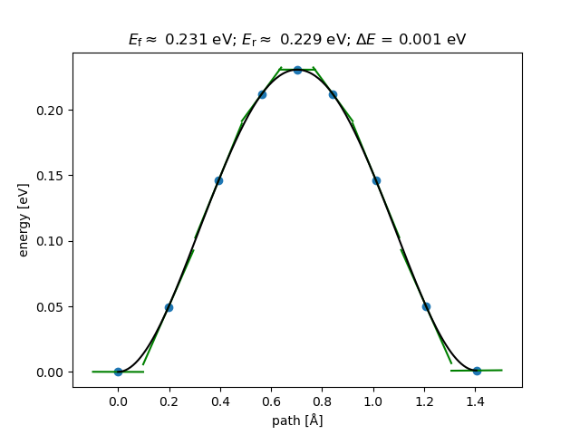
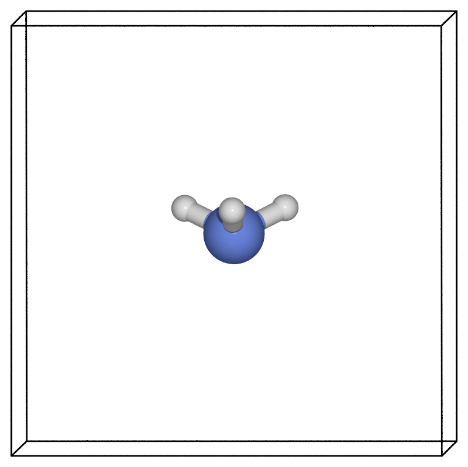

# Nudged elastic band tutorial


## Overview and background

The nudged elastic band (NEB) approach is a widely-used method for finding a minimum energy pathway between two configurations of atoms. 
You can use the method to estimate the barrier for the system to transition between the two structures. 

The technique starts with two fixed end points which are fully relaxed (local) minima: the initial and final configurations. It then connects these end points with a series of "images" via fictitious springs that "pull" the structures taut over one or more intermediate transition states. 

In this tutorial, we will use the well-known example of an ammonia molecule's [pyramidal inversion](https://en.wikipedia.org/wiki/Pyramidal_inversion#Energy_barrier)


We will cover:

- How to set up the initial, final (and intermediate) structures
- How to actually run the NEB calculation efficiently
- How to analyse the results
- Other tips and tricks


## Files

You can find all the files needed for this tutorial here: [neb_tutorial.tar.gz](neb_tutorial.tar.gz)


## Setting up the structures

### Setting up the initial and final states
These are the local minima structures you want to find the barrier between. They can be equivalent structures, e.g. differing by a symmetry operation, such reflection through a mirror plane, or they can be configurations with different energies (in which case your forward and reverse barriers will not be the same!). Two crucial conditions must be met **before running the NEB calculation**:

1. The end point structures must be fully relaxed (geometry optimised) before you start the NEB. Note that both the initial relaxations and the actual NEB calculation must use consistent parameters (e.g. basis set, pseudopotentials, k-points, XC functional etc.).
2. The atoms must be in the correct order. A common mistake is to use a software tool to generate the final state from the initial state and end up with atoms that don't match the initial atom order. Atoms then "pass through each other" when CASTEP interpolates between the two structures, causing the calculation to blow up. Always check that the atoms connect up in the way you expect. Note that, for CASTEP, only the atom order within a given species matters, not the order of the species themselves. In this example, we make sure that the H atoms are in the same order in the initial, final and intermediate structures and we can have the N coordinate either before or after the H atom coordinates.


The initial state is specified in the same way as a normal .cell file, e.g.:

```
%BLOCK positions_frac
   H              0.500011764912384       0.634846485697942       0.443086003907125
   H              0.616593728396204       0.432553816946042       0.442828605918639
   H              0.383248448613152       0.432623959245757       0.443068863520867
   N              0.500000000000000       0.500000000000000       0.500000000000000
%ENDBLOCK positions_frac
```


The final state is specified using a similar block in the same .cell file but with `_product` appended to the name of the block, e.g.:

```
%BLOCK positions_frac_product
   H              0.500154169007758       0.634858887961251       0.556834437330747
   H              0.616661280589956       0.432482046338754       0.556941161085851
   H              0.383366127862304       0.432719065607707       0.557277918851780
   N              0.500000000000000       0.500000000000000       0.500000000000000
%ENDBLOCK positions_frac_product
```


### Setting up the transition state guess

CASTEP requires you to provide **one** intermediate structure between the initial and final configurations in order to get the NEB on the right track. The intermediate configuration is added using, e.g.:

```
%BLOCK POSITIONS_ABS_INTERMEDIATE
ang
N  3.500000  3.500000  3.500000
H  3.500000  4.443968  3.500000
H  4.316393  3.027626  3.500000
H  2.683149  3.028701  3.501215
%ENDBLOCK POSITIONS_ABS_INTERMEDIATE
```

CASTEP will linearly interpolate from the initial to intermediate and the intermediate to final structures provided to generate the rest of the path, depending on the number of images you have chosen.

In many cases, a suitable transition state guess structure is simply the halfway point between the initial and final structures (a linear interpolation between the coordinates). However, if your minimum energy pathway contains e.g. a rotation of a (group of) atom(s) around a bond or something similar, then the linear path between initial and final configurations may be a bad starting guess/non-physical structure. For example, if your end points correspond to a C2 rotation, then a linearly interpolated intermediate structure would not be a physical one. It's important to visualise or otherwise check all of your structures before running a calculation.

Intermediate structures can also be chosen in such a way as to bias your results to one pathway over another.

<!-- TODO: change this in future castep release where this is no longer a required block -->


### How many images do I need?

It depends... It's usually preferable to start with a small number of images and increase the number if you need to. Starting small can quickly give you a rough sense of the energy landscape and that will determine the actual number of images needed. 

In addition, if you start with too many images then you might never get close to the converged TS because the optimisation takes too long. If you instead start with a small number and get a reasonable TS structure, you can then use that as your initial intermediate structure in a restarted calculation with more images.

Using many (i.e. > 15) will result in slow convergence, but may lead to a more accurate minimum energy pathway for complex barriers. If you do find a particularly complex pathway, however, you might be better off splitting the work up into more than one NEB calculation, each with fewer images. Just remember to always fully relax the end points (even if the end point is a meta-stable local minimum)!  

Using too few (i.e. < 5) might fail to find the minimum energy pathway if the energy landscape is complex.

The TS guess structure that you specify in the .cell file will be assigned to the middle image, with the other images being initially linearly interpolated between the initial, TS guess and final structures. If you choose an even number of images, the 'middle' one is taken to be the one to the right of the centre. e.g. for 6 images, the TS guess will be assigned to image 4. This will make your initial NEB asymmetric in the sense that there will be more images to the left of the TS guess than to the right. If the TS guess is estimated to be in the geometric centre of the minimum energy pathway, then it's probably best to use an odd number of images.

As the minimum energy pathway is very simple in this example, we can actually get away with just one image. However, we'll use 7 images here to illustrate the process. As an exercise, you can try running the same calculation with `tssearch_max_path_points: ` 1, 2, 3, 4, 5 images and note how the results change.


Some questions to help answer how many images you need:

- How complex is the landscape between the initial and final state? For example, if you expect more than one maximum between the end points, you probably need more images than for the single peak example we look at here.


!!! note 
      The number of images is the number of structures *between* the end points. The total number of structures in the path (i.e. including the end points) is therefore the number of images + 2.


### Constraints

We can often dramatically improve the efficiency of the transition state search by imposing constraints on the atomic positions, although this must be done with care so as not to introduce artifacts. For example, when looking at NEB barriers for adsorbates on a surface slab, we can usefully constrain the bottom slab layers, but probably want the top layer(s) unconstrained.

In the ammonia case, we can constrain the N atom position without affecting the physical set up by adding the block:

``` 
%BLOCK IONIC_CONSTRAINTS
 fix: N
%ENDBLOCK IONIC_CONSTRAINTS
```

to the `nh3.cell` file.


You should then see something like:

```
  --- Initialising NEB constraints ---
     Fixed            3  degrees of freedom
```
 
in the `.castep` output file.


### Do I need climbing NEB?

The climbing NEB method modifies the force on the highest-energy image such that it tries to climb *up* the barrier. 
This is very useful to get an accurate estimate of the transition state configuration and barrier since you ensure that one image sits exactly at the saddle point of the minimum energy pathway. However, care must be taken when exploring more complex pathways (i.e. with multiple maxima) since it might become ambiguous as to which image should be the one to "climb".

In our example the path is quite straightforward and will not make a large difference whether we use the climbing or regular NEB method. We can set:

`TSSEARCH_NEB_CLIMBING: TRUE`

in the .param file. Though it's not necessary in this case, we will use it here to illustrate the process.

To illustrate a case in which climbing NEB is more important, consider briefly another example: that of the HCN - HNC isomerisation. In this case, the minimum energy pathway is not a simple linear interpolation between the initial and final states and the minimum energy pathway is not symmetric. The climbing NEB method is very important to get an accurate estimate of the barrier and transition state structure. In Fig 1., we compare the regular and climbing NEB methods using 7 images. While we can find similar barrier heights using both methods if we use a suitable interpolation scheme for the regular NEB, the regular NEB does not find the correct transition state structure. The climbing NEB, on the other hand, finds the correct transition state structure and barrier height.


<figure fig1>
  <figcaption>Fig1. Comparison of the regular NEB (left) and the climbing NEB (right) methods for the case of an HCN - HNC isomerisation. The red circle markers indicate the highest-energy structure in each case. The initial, transition state and final configurations are shown for the climbing NEB, with white, blue and brown spheres representing H, N and C respectively. Note that these are not converged calculations, but are simply provided as a simple comparison of the NEB methods. </figcaption>
</figure>

!!! note
      The climbing image method in CASTEP requires an odd number total number of images. Therefore, if you choose an even number of images in your `.param` file, CASTEP will automatically add one more image.

<!-- TODO: clarify what happens when you set climbing to true.   -->

<!-- TODO: include advice/explanation about starting with regular NEB and turning on climbing image after a few steps.  -->


## Running the NEB

### Parallelisation
Because the NEB calculation essentially involves *N* independent CASTEP calculations (where *N* is the number of images), we can make very efficient use of high-performance computers. This is done via "task farming", running the calculations for the *N* images independently. For example, if one CASTEP calculation fits on one node, and you have 7 images, then you could run on a total of 7 nodes by setting the keyword:

`NUM_FARMS: 7`

in the .param file. 

A good rule of thumb is to aim for `NUM_FARMS` = number of NEB images. That way each 'farm' is responsible for one NEB image. Since each farm will effectively run a series of single-point calculations on each NEB image they are responsible for, the compute resources of that farm should be appropriately sized for such calculations. Too small and you could get an out-of-memory error, too large and you might end up over-parallelising, leading to reduced overall performance. i.e. you should aim to run on a total of `NUM_FARMS` times as many cores as you would use for a single-point calculation on one of the structures.  

This also assumes that your available compute resources can be neatly split into `NUM_FARMS`. The easy case is when each farm can run on a single node; i.e. `NUM_FARMS` = number of NEB images = number of nodes. Note that the total number of cores available must be divisible by `NUM_FARMS`. 

If you choose `NUM_FARMS` < number of images, each of the images will run sequentially on one farm as soon as that farm becomes available. If the number of images is not a multiple of `NUM_FARMS`, some farms will end up being responsible for more images than others, leading poor overall efficiency.

If you choose `NUM_FARMS` > number of images, then some farms will be left with nothing to do, resulting in poor overall efficiency.

Setting `NUM_FARMS = 1` is equivalent to not setting `NUM_FARMS`.

You will notice that if you enable task farming, the seedname.castep output file will look relatively empty, as most output is split into the different task farm .castep files. The first indexed one contains the most important information (for example, the "Max NEB force") and will be called e.g. `seedname_farm001.castep`. 


### Is the calculation converging?
You can monitor the convergence by searching for "Max NEB force" within the .castep output file.

Common convergence issues include:

- Not having consistent atom order in the initial and final structures, i.e. non-physical initial path. This is one of the more common reasons for failed calculation. It's always important to visualise the initial and final structures and check that the atoms connect up in the way you expect.
- Too many (or too few) images. Too many images can lead to slow convergence, too few can lead to the calculation failing to find the minimum energy pathway.
- Initial or final state (endpoints) not being fully relaxed structures

### Restarting / Continuing 

Sometimes the calculation will run out of time/number of iterations before the NEB calculation is finished. 
You will probably see a "Failed to converge" message in the .castep output in that case; always read through your output files!

If you re-run the calculation without changing anything, it will simply start from the beginning again -- probably not what you want!

In order restart the NEB from the last checkpointed state, you need to **explicitly** set the name of the .check file you want to continue from in your .param file. In our example that would be:

```
continuation: nh3.check
```

In the .castep output you would then see: `Coordinates of NEB images loaded from checkpoint file`. 

!!! warning
      Unlike other CASTEP tasks, setting `continuation: default` does not seem to work for continuing/restarting NEB calculations! You must explicitly set the name of checkpoint file.


## Analysis

Once you have a converged NEB, the provided Python utility `readTS` can be used to parse and analyse the NEB. 
To add the readTS module to your PYTHONPATH, you can find a setup.py script in the `castep/Utilities/readts` directory of your CASTEP source directory. Running `python setup.py` should install the module to your path. You can also manually add it by inserting the following line into your ~/.bashrc or equivalent and restarting the terminal: 

``` bash
export PYTHONPATH="/path/to/castep/Utilities/readts:$PYTHONPATH"
```

(changing the `/path/to/castep/` bit to wherever CASTEP is on your machine).

You can then extract the NEB path using something like this python code:

```python
## get this by adding castep/Utilities/readts to your PYTHONPATH
from readts import TSFile 
from ase.neb import NEBTools


def get_images(tsfile):
    '''
   Function to extract the 
   final NEB images from a tsfile object

   Args: 
        tsfile (TSFile): tsfile object
   
   Returns:
        images (list): list of ASE atoms objects
   '''
    diam_tst = tsfile.blocks['TST']

    diam_i = tsfile.blocks['REA'][1][0]
    diam_f = tsfile.blocks['PRO'][1][0]
    nbeads = len(diam_tst[1])
    max_idx = diam_tst.last_index
    images = [diam_i.atoms]
    images += [diam_tst[max_idx][i].atoms for i in range(0, nbeads, 1)]
    images.append(diam_f.atoms)
    return images

def plot_band(images, filename='neb.png'):
    nt = NEBTools(images)
    energies = nt.get_barrier()
    print(f'Barrier height:      {energies[0]:16.5f} eV')
    print(f'E_final - E_initial: {energies[1]:16.5f} eV')
    nebplot = nt.plot_band()
    nebplot.savefig(filename)


if __name__ == '__main__':
    import sys
    seedname = sys.argv[1]
    path = './'
    tolerant = False
    if len(sys.argv) > 2:
        tolerant = bool(sys.argv[2])
    tsfile = TSFile(seedname, path=path, tolerant=tolerant)
    images = get_images(tsfile)
    plot_band(images)

    # we can use ASE to write out the structure 
    # in whatever format we want
    print('Image\t\t Energy (eV)')
    for i,atoms in enumerate(images):
        print(f'{i:03d}\t {atoms.get_potential_energy():16.5f} eV')
        ## this format includes the energy of the image
        atoms.write(f'image-{i:03d}.xyz') 


    ## We can also use the ASE GUI to 
    ## view the images and analyse the NEB path.
    ## Select Tools -> NEB Plot
    # from ase.visualize import view
    # view(images)
```

If we save this script as analysis.py and run it in the directory containing both the nh3.cell and nh3.ts files like this:

```bash
python analysis.py nh3
```

we will get an .xyz file for each structure in the optimised NEB path and the energy of each image. We will also get the barrier estimate and a NEB plot showing the barrier.

The ASE GUI can also be used to plot the NEB band (uncomment the last two lines in the above script and Select Tools → NEB Plot from the GUI). 


The ASE-generated plot looks like this:



The green lines show the tangents at those points; these can be useful indicators of convergence. 

The barrier we obtained is about 0.23 eV, which compares well with the value of 0.25 eV (24.2 kJ/mol) [from Wikipedia](https://en.wikipedia.org/wiki/Pyramidal_inversion#Energy_barrier).

We might also notice the slight difference in energy between the two end-points of the path (about 1 meV). These should be identical, so any difference can be used as a very rough guide for the amount of numerical noise in the geometry optimisations.
If equivalent structures (the end-points in this example) were found to have very different energies, you would need to go back and tighten up your convergence criteria or force/energy tolerances in the initial geometry optimisations and re-run the NEB calculation with these tightened parameters. 

Using our favourite visualisation software (here we used the [ASE POV-Ray interface](https://wiki.fysik.dtu.dk/ase/ase/io/io.html#examples)), we can then look at how the structure evolves along the minimum energy pathway found via the NEB.




!!! note "Zero point energy corrections"
        All of the above calculations were done while treating the nuclei as classical particles. In many cases, particularly when lighter atoms are involved, the energy barrier estimates would need to be corrected for quantum-nuclear effects.

        The simplest approach to accounting for the true quantum nature of nuclei is to compute the vibrational frequencies of the nuclei within the harmonic approximation. You need would need to do this for the reactant and transition state configurations and use, for example, equation 2 from [J. Chem. Phys. 124, 044706 (2006)](http://theory.cm.utexas.edu/henkelman/pubs/henkelman06_044706.pdf) to obtain the Harmonic quantum correction to the barrier.


<!-- 
### Zero-point energy corrections

TODO: add instructions for harmonic ZPE corrections. -->
